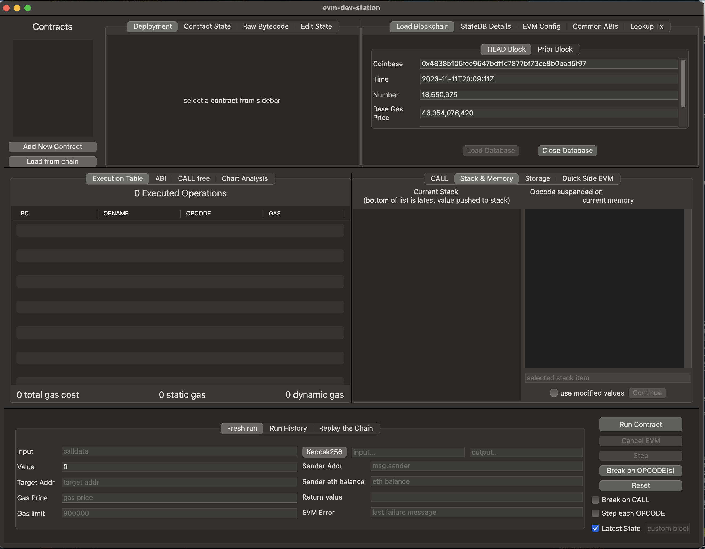
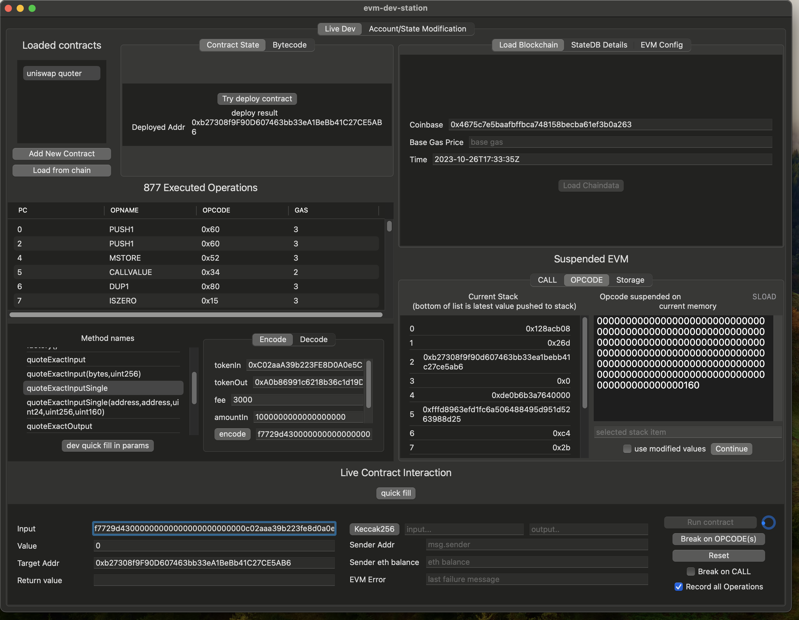

# evm-dev-station

Currently ALPHA(ALPHA(ALPHA(ALPHA())))

git clone this repo and run `./evm-dev-station`. Its a fat binary, so it works on both
intel and apple silicon based darwin machines.

# work flow

You can run EVM code/deploy contracts immediately against in memory state OR you can load up a
blockchain database and use that.

Only works with `geth` created leveldb or pebble based databases (and currently just tested with
pebble based db)

1. You load up a database via the button called `Load Chaindata` this is the `chaindata` directory
   inside your `geth` --datadir. Don't use the currently running one, instead make a copy so you can
   operate on a snapshot of the blockchain. Aka if your datadir parameter to geth was
   ` --datadir=/mnt/0ae570e6-4377-47fa-bc8e-21fc1ed96974/home/mev/eth-mainnet/chaindb` then stop it
   momentarily and make a copy of
   `/mnt/0ae570e6-4377-47fa-bc8e-21fc1ed96974/home/mev/eth-mainnet/chaindb/geth/chaindata`
   aka the `chaindata`. This is your database directory we'll use
2. in the `Load Chaindata` button in the upper right, you give the path to the directory with the
   copied `chaindata`
3. Load contracts from the left hand side list, the `Load from chain` with optional ABI.
4. Give input data if any, hit `Run Contract`

# ideas, feedback

Huge amounts of bugs. Yes its currently closed source, but still open tickets, issues with
screenshots please showing what happened wrong. I'll add a git commit to the UI so we can double
check what version you had issues with. Right now its probably more useful to tell, share ideas
about what you'd like to be able to do, see, how it ought to interact, font changes, animations etc.

see https://twitter.com/EdgarArout/status/1720939792098107443 for an example of how to change the
value of `SLOAD`

# architecture

golang compiled into a C static library, statically linked into native swift binary.
